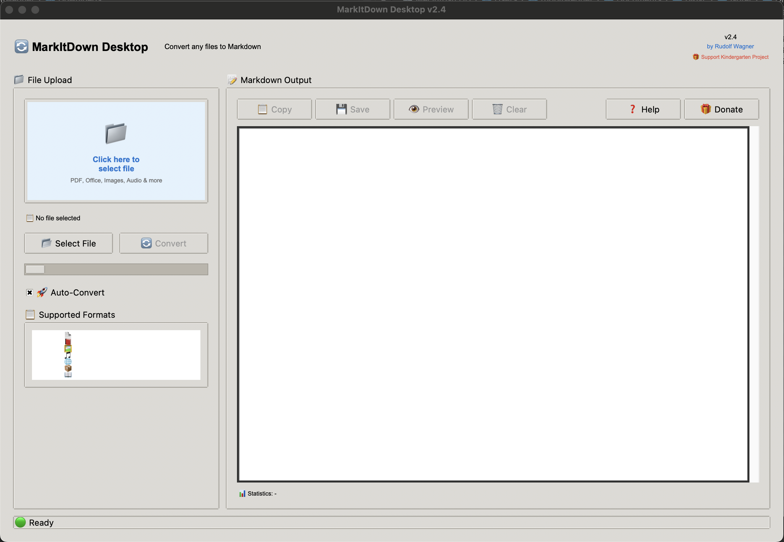

# 🔄 MarkItDown Desktop

Eine benutzerfreundliche Desktop-Anwendung für **Microsoft's MarkItDown Tool** von **Rudolf Wagner**.

> **Basiert auf:** [Microsoft MarkItDown](https://github.com/microsoft/markitdown) - Ein Python-Tool zur Konvertierung verschiedener Dateiformate zu Markdown.

[](https://python.org)
[](LICENSE)
[](https://github.com/microsoft/markitdown)
[](https://www.paypal.com/donate/?hosted_button_id=PAGH54TWEXP54)

## 🚀 Sofort-Start für Dummies

**Keine Sorge - auch ohne Programmierkenntnisse!**

### Windows:
1. **Python installieren:** Gehe zu https://python.org/downloads → **"Download Python"** → ✅ **"Add Python to PATH"** aktivieren
2. **App herunterladen:** [Rechtsklick hier → "Ziel speichern unter"](https://raw.githubusercontent.com/rudolfwagner/markitdown-desktop/main/markitdown_desktop.py) → als `markitdown_desktop.py` speichern
3. **Terminal öffnen:** Windows-Taste + R → `cmd` eingeben → Enter
4. **Zum Ordner navigieren:** `cd Downloads` (oder wo du die Datei gespeichert hast)
5. **App starten:** `python markitdown_desktop.py`
6. **Fertig!** Die App installiert automatisch alles weitere

### macOS:
1. **Terminal öffnen:** Spotlight (Cmd+Space) → "Terminal" eingeben → Enter
2. **App herunterladen:** `curl -O https://raw.githubusercontent.com/rudolfwagner/markitdown-desktop/main/markitdown_desktop.py`
3. **App starten:** `python3 markitdown_desktop.py`
4. **Fertig!** Automatische Installation aller Abhängigkeiten

### Bei Problemen:
- **Python nicht gefunden?** Installiere Python von https://python.org
- **Fehler beim Download?** Versuche den direkten Download-Link oben
- **Immer noch Probleme?** Erstelle ein [Issue hier](https://github.com/rudolfwagner/markitdown-desktop/issues)

---

## 🎁 Besonderes Projekt

Der Entwickler gründet einen Kindergarten! Unterstütze dieses bedeutungsvolle Projekt:
**[💝 Jetzt spenden via PayPal](https://www.paypal.com/donate/?hosted_button_id=PAGH54TWEXP54)**

## 📸 Screenshots


*Die moderne, intuitive Benutzeroberfläche*

## ✨ Features

- 🔄 **Auto-Konvertierung** - Sofortige Umwandlung nach Dateiauswahl
- 📁 **Drag & Drop** - Dateien einfach in die App ziehen
- 👁️ **Live-Vorschau** - HTML-Preview der Markdown-Ausgabe
- 📋 **Ein-Klick Export** - Kopieren oder als .md speichern
- 📊 **Statistiken** - Zeilen, Wörter, Zeichen-Zählung
- 🎁 **Kindergarten-Unterstützung** - Direkter Spendenlink integriert
- 🛡️ **macOS optimiert** - Crash-sicher und stabil

## 📋 Unterstützte Dateiformate

| Kategorie | Formate | Beschreibung |
|-----------|---------|--------------|
| **📄 Office** | `.docx`, `.doc`, `.xlsx`, `.xls`, `.pptx`, `.ppt` | Microsoft Office Dokumente |
| **📕 PDF** | `.pdf` | Alle PDF-Dokumente |
| **🖼️ Bilder** | `.jpg`, `.jpeg`, `.png`, `.gif` | Mit OCR-Texterkennung |
| **🎵 Audio** | `.mp3`, `.wav` | Mit Sprachtranskription |
| **🌐 Web/Daten** | `.html`, `.csv`, `.json`, `.xml` | Strukturierte Daten |
| **📦 Archive** | `.zip` | Iteriert über Inhalte |
| **📖 E-Books** | `.epub` | Elektronische Bücher |

## 🚀 Installation & Start

### Voraussetzungen
- **Python 3.7+** ([Download hier](https://python.org/downloads/))
- **Internet-Verbindung** (für automatische Installation der Abhängigkeiten)

### Schnellstart

1. **Repository herunterladen:**
   ```bash
   git clone https://github.com/rudolfwagner/markitdown-desktop.git
   cd markitdown-desktop
   ```

2. **App starten:**
   ```bash
   python markitdown_desktop.py
   ```

3. **Automatische Installation:** Die App installiert alle benötigten Pakete automatisch beim ersten Start!

### Alternative Downloads

- **[📥 Neueste Version (ZIP)](https://github.com/rudolfwagner/markitdown-desktop/archive/main.zip)**
- **[📋 Nur Python-Datei](https://raw.githubusercontent.com/rudolfwagner/markitdown-desktop/main/markitdown_desktop.py)**

## 🎯 Verwendung

1. **Datei auswählen** - Klicke auf die blaue Fläche oder den "Datei auswählen" Button
2. **Auto-Konvertierung** - Die Umwandlung startet automatisch
3. **Markdown anzeigen** - Das Ergebnis erscheint rechts
4. **Exportieren** - Kopieren, Speichern oder Vorschau

## 🎁 Den Kindergarten unterstützen

Dieser Entwickler gründet einen Kindergarten! Jede Spende hilft, eine liebevolle Umgebung für die frühkindliche Bildung zu schaffen.

**[🎁 Jetzt spenden via PayPal](https://www.paypal.com/donate/?hosted_button_id=PAGH54TWEXP54)**

*Direkt aus der App heraus spenden - Spendenbutton ist integriert!*

## 🛠️ Entwicklung

### Lokale Entwicklung
```bash
git clone https://github.com/rudolfwagner/markitdown-desktop.git
cd markitdown-desktop
pip install -r requirements.txt
python markitdown_desktop.py
```

### Dependencies
- `markitdown[all]` - Microsoft's MarkItDown Tool
- `tkinter` - GUI Framework (meist vorinstalliert)
- `Pillow` - Bildverarbeitung
- `requests` - Netzwerk-Requests

## 📄 Lizenz

MIT License - siehe [LICENSE](LICENSE) Datei für Details.

## 👨‍💻 Über den Entwickler

**Rudolf Wagner**
- 🔗 LinkedIn: [Rudolf Wagner](https://www.linkedin.com/in/rudolfwagner)
- 🎁 Kindergarten-Projekt: [Spenden](https://www.paypal.com/donate/?hosted_button_id=PAGH54TWEXP54)

## 🤝 Beitragen

Beiträge sind willkommen! Bitte lese [CONTRIBUTING.md](CONTRIBUTING.md) für Details.

1. Fork das Repository
2. Erstelle einen Feature Branch (`git checkout -b feature/AmazingFeature`)
3. Commit deine Änderungen (`git commit -m 'Add some AmazingFeature'`)
4. Push zum Branch (`git push origin feature/AmazingFeature`)
5. Öffne einen Pull Request

## 🆘 Support

- **📖 Dokumentation:** [docs/](docs/)
- **🐛 Bug Reports:** [Issues](https://github.com/rudolfwagner/markitdown-desktop/issues)
- **💬 Diskussionen:** [Discussions](https://github.com/rudolfwagner/markitdown-desktop/discussions)

## 🙏 Danksagungen & Attribution

### Microsoft MarkItDown
Diese Anwendung basiert auf dem **[Microsoft MarkItDown Tool](https://github.com/microsoft/markitdown)**:
- **Repository:** https://github.com/microsoft/markitdown
- **Lizenz:** MIT License
- **Copyright:** Microsoft Corporation
- **Beschreibung:** "Python tool for converting files and office documents to Markdown"

**Unser Dank gilt Microsoft für die Bereitstellung dieses hervorragenden Open-Source-Tools!**

### Genutzte Open-Source-Projekte
- **[Python](https://python.org)** - Programmiersprache
- **[Tkinter](https://docs.python.org/3/library/tkinter.html)** - GUI Framework
- **[Pillow](https://pillow.readthedocs.io/)** - Bildverarbeitung
- **[Requests](https://requests.readthedocs.io/)** - HTTP-Bibliothek

### Community & Unterstützung
- **Alle Spender** für die Unterstützung des Kindergarten-Projekts
- **GitHub Community** für Feedback und Beiträge
- **Open-Source Community** für die genutzten Bibliotheken

## 🆕 Recent Updates

**v2.5 (June 2024)**
- ✅ Fixed emoji display issues on macOS
- ✅ Clean, text-based interface
- ✅ Better cross-platform compatibility
- ✅ All functionality maintained

**v2.4 (June 2024)**
- ✅ Complete GUI with donation support
- ✅ Kindergarten project integration
- ✅ Professional documentation

---

<div align="center">

**⭐ Wenn dir dieses Projekt gefällt, gib ihm einen Stern auf GitHub! ⭐**

**🎁 [Unterstütze das Kindergarten-Projekt](https://www.paypal.com/donate/?hosted_button_id=PAGH54TWEXP54) 🎁**

**🔗 [Microsoft MarkItDown Original](https://github.com/microsoft/markitdown) 🔗**

*Entwickelt mit ❤️ von [Rudolf Wagner](https://www.linkedin.com/in/rudolfwagner)*
*Basiert auf Microsoft MarkItDown unter MIT License*

</div>
